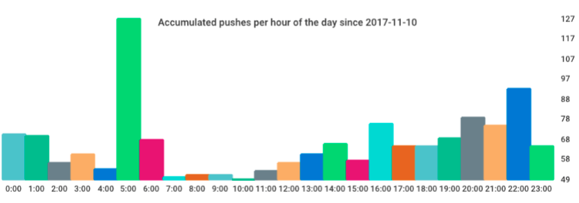

## Harbor Analytics

[](https://goreportcard.com/report/github.com/demonware/harbor-analytics)

### Automatically generate and publish PDF usage reports about your Harbor docker registry.



### Easy to run, easy to extend.

Harbor Analytics is a set of tools that - together - form a workflow
to generate a usage report of a harbor docker registry.

The usual workflow that is incorporated in Harbor Analytics is:
- Download the latest CSV files that represent the current harbor registry
- Perform analytical tasks on the raw data and convert them to human-readable statistics
- Export the statistics as graphical charts
- Generate a PDF containing the charts and descriptions
- Publish the PDF report on a slack channel

### Prerequisites

In order to be able to use Harbor Analytics you will need:
- CSV files generated from the harbor database on either an S3 bucket or locally
- Docker (installed on the machine on which you run the workflow)
- Access to a slack token (if you want to report the metrics)
- A workflow runner (e.g. Jenkins - Jenkinsfile in repo) if you want to run the workflow in a controlled environment

### Usage

#### Prepare Data
First we will need the flat CSV data. Either copy them manually INTO
the *raw* folder or run. Make sure they are named correctly (check analyst/parser.go to see what's expected).
```
make get-raw-data
```

You may need to run
```
make build-raw-data-fetcher
```
before to create the docker image that will pull your CSVs from S3.

#### Build Tool
This is optional and only necessary if you have performed any changes in the
analyst source code.
Recompile the go tool with
```
make build
```
This will create a new docker image with the analyst tool in it.
You can also compile the tool on your machine directly with
```
cd analyst && make build
```
This will not create a docker image and instead just provide you with the
executable analyst binary.

#### Configure
You can configure what kind of analysis the tool should perform through the `analyst.yaml` config file.

The `charts` item holds a list of items describing the charts to be generated
from the raw data and put into the end report. A charts item is described
by specifying a stats method (a method of the *registry* struct which accepts a *StatsMethodParameters* parameter and returns a *outputgen.BarChartable*) and their parameters as sub-items.

### Run the analysis
```
make run
```
This will create the analytics report PDF and output it to the *out* folder.
Note, however, that this will run the dockerised analyst.
If you created a binary on you machine, you need to run
```
cd analyst && ./analyst
```
instead.

### Publish the Report to slack
```
make publish
```
This will post the PDF report on to a slack channel.
